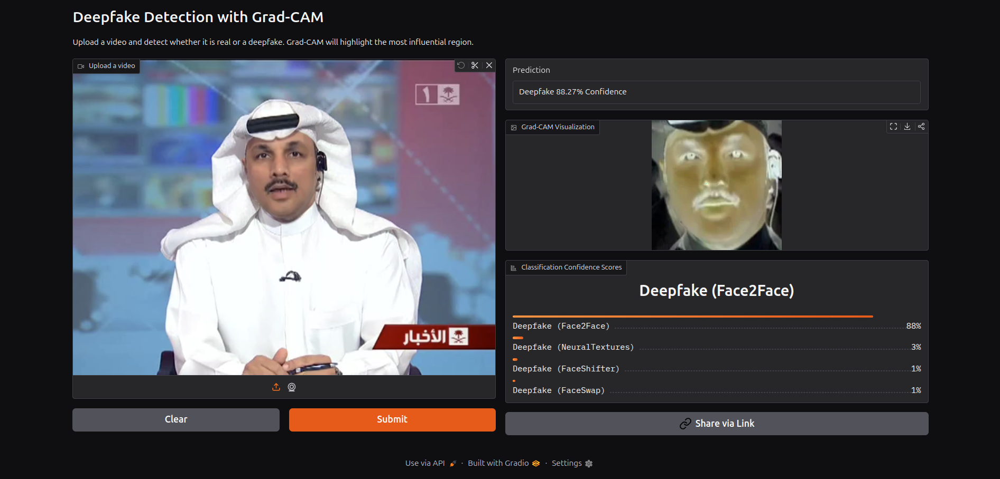

# Project DeepDetect

> **In the age of deepfakes, seeing is no longer believing.**  
> But even if you can't trust your eyes, you can trust us.

[**DeepDetect**](https://huggingface.co/spaces/SanskarModi/deepdetect) is an AI-powered application that helps you uncover the truth behind manipulated media.

> 🔹 **Deployment Note:**  
> The public Hugging Face Space uses a **Gradio interface** for interactive demos and explainability.  
> A **FastAPI backend** is also included in this repository for production-style API usage and integration.


<br/>



---

## ⚠️ Important Notice

> **Note:** Due to limited computational resources, the current model has been trained on a relatively small dataset using a short `sequence_length` of 10.  
> This means it utilizes only 10 frames from any uploaded video to make a prediction.

### 📊 Performance on Test Set:
- **Accuracy:** ~93%
- **F1 Score:** ~93%

---

## 🚀 Features

- 🔍 Deepfake detection using AI
- 🖼️ Visual explanation via heatmaps
- 🎛️ Gradio-powered user interface
- ⚡ FastAPI backend for scalable inference (not used in Hugging Face Space)
- ⚙️ End-to-end ML pipeline with MLflow & DVC integration

---

## 🛠️ Tech Stack

- **Data Processing:** NumPy, Pandas  
- **Modeling:** PyTorch, Scikit-learn  
- **Image & Video:** OpenCV, MediaPipe  
- **Visualization:** Plotly  
- **MLOps:** MLflow, DVC  
- **UI:** Gradio  
- **Deployment:** Hugging Face Spaces  

---

## 🏗️ Project Structure

```
DeepDetect/
│
├── src/
│   └── DeepfakeDetection/
│       ├── components/       # Core components: data loading, preprocessing, training
│       ├── utils/            # Utility scripts and helpers
│       ├── config/           # Configuration files
│       ├── pipeline/         # Modular pipeline stages
│       ├── entity/           # Configuration entity classes
│       └── constants/        # Constants and global values
│
├── config/                   # Global configs
├── app.py                    # Gradio app entry point
├── main.py                   # Pipeline runner
├── requirements.txt          # Python dependencies
├── pyproject.toml            # Project metadata
├── params.yaml               # Model & training parameters
├── dvc.yaml                  # DVC pipeline configuration
├── Dockerfile                # Docker setup
├── structure.py              # Script to auto-generate project structure
└── format.sh                 # Shell script for formatting code
```

---

## ⚙️ Setup Instructions

1. Clone the repository:
   ```bash
   git clone https://github.com/your-username/DeepDetect.git
   cd DeepDetect
   ```
2. Make sure Python ≥ 3.9 is installed.
3. Update `requirements.txt` to `.e` if needed, then run:
   ```bash
   pip install -r requirements.txt
   ```
4. Install [CMake](https://cmake.org/download/)  
   On Ubuntu:
   ```bash
   sudo apt install cmake
   ```
5. (Optional) Install Docker for containerized deployment.
6. Download the [FaceForensics++](https://github.com/ondyari/FaceForensics) dataset (see below).  
   Update the `source_data` path in `config/config.yaml` to point to your local data directory.

---

## 📂 Dataset: FaceForensics++

This project uses the **FaceForensics++** dataset.

To obtain it:

1. Visit the official repository:
   [https://github.com/ondyari/FaceForensics](https://github.com/ondyari/FaceForensics)
2. Fill out the dataset request form
3. After approval, you will receive:

   * Download credentials
   * An official download script
4. Use the provided script to download the data locally
5. Update the dataset path in:

   ```
   config/config.yaml
   ```

⚠️ **The dataset is not included in this repository and cannot be redistributed.**

---


## 🧪 Usage

### Quick Start (Full Pipeline)

```bash
dvc init --force
dvc repro
```

**Or manually:**

```bash
python main.py
```

### Stage-wise Execution

```bash
# Step 1: Data Ingestion
python src/DeepfakeDetection/pipeline/stage_01_data_ingestion.py

# Step 2: Preprocessing
python src/DeepfakeDetection/pipeline/stage_02_data_preprocessing.py

# Step 3: Model Training
python src/DeepfakeDetection/pipeline/stage_03_model_training.py

# Step 4: Evaluation
python src/DeepfakeDetection/pipeline/stage_04_model_evaluation.py
```

### Launch App

### 🎛️ Gradio Demo (Hugging Face / Local UI)

```bash
python app.py
```

### ⚡ FastAPI Backend (Local / Production)

```bash
uvicorn api:app --host 0.0.0.0 --port 8000
```

> 🔐 **Note:**  
> By default, the prediction pipeline loads the model from MLflow (logged during training).
> Ensure MLflow initialization is **enabled** in:
   * `stage_03_model_training.py`
   * `stage_04_model_evaluation.py`
> Set up your `.env` file with MLflow credentials at the project root, and make sure you’ve executed `dvc repro`.  
>```env
>MLFLOW_TRACKING_URI=your_mlflow_tracking_uri
>MLFLOW_TRACKING_PASSWORD=your_mlflow_pass
>```
> Update `prediction.py` to load **your generated MLflow run**, for example:
>```python
>mlflow.pytorch.load_model("runs:/<your_run_id>/model")
>```
> **Alternatively**, if you don’t want to use MLflow, modify the loading logic in `prediction.py` to use the trained model (after running the complete pipeline) located at:
> ```
> /artifacts/model_training
> ```

---

## 🤝 Contributing

We’d love your contributions!

1. Fork the repo  
2. Create a new branch:  
   ```bash
   git checkout -b feature/amazing-feature
   ```
3. Make your changes & commit:
   ```bash
   git commit -am "Add amazing feature"
   ```
4. Push your branch:
   ```bash
   git push origin feature/amazing-feature
   ```
5. Open a Pull Request

---

## 📄 License

This project is licensed under the [GPL-3.0 License](https://www.gnu.org/licenses/gpl-3.0.en.html).

---

<p align="center">
  Made with ❤️ by <strong>Sanskar Modi</strong>
</p>